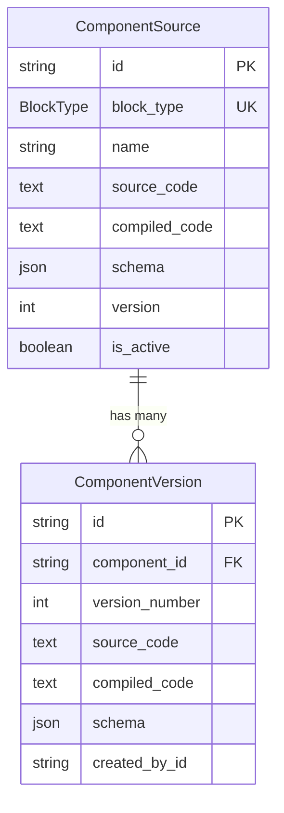

# Component Source Schema Documentation

## Overview

The Component Source system provides a foundation for dynamic, versionable React components that can be stored, compiled, and rendered at runtime. This enables hot-swapping of component implementations without requiring application redeployment.

## Database Schema

### ComponentSource Table

The `component_sources` table stores the current state of each dynamic component.

| Column | Type | Description |
|--------|------|-------------|
| `id` | TEXT | Primary key (CUID) |
| `block_type` | BlockType | Unique identifier linking to BlockType enum |
| `name` | TEXT | Human-readable component name |
| `description` | TEXT | Optional component description |
| `source_code` | TEXT | Raw JSX/TSX source code |
| `compiled_code` | TEXT | Compiled JavaScript code ready for execution |
| `schema` | JSONB | JSON Schema for props validation |
| `version` | INTEGER | Current version number (default: 1) |
| `is_active` | BOOLEAN | Whether component is active (default: true) |
| `created_at` | TIMESTAMP | Creation timestamp |
| `updated_at` | TIMESTAMP | Last update timestamp |
| `last_compiled_at` | TIMESTAMP | Last successful compilation timestamp |

#### Indexes

- `block_type` (unique) - Fast lookup by block type
- `is_active` - Filter active components
- `updated_at DESC` - Sort by recent updates

#### Example Record

```json
{
  "id": "cm123abc",
  "block_type": "HERO",
  "name": "Hero Component",
  "description": "Dynamic hero section with customizable content",
  "source_code": "export default function HeroBlock({ heading, subheading }) { ... }",
  "compiled_code": "/* Compiled code */",
  "schema": {
    "type": "object",
    "properties": {
      "heading": { "type": "string", "required": true },
      "subheading": { "type": "string" }
    }
  },
  "version": 3,
  "is_active": true,
  "created_at": "2025-01-15T10:00:00Z",
  "updated_at": "2025-01-20T14:30:00Z",
  "last_compiled_at": "2025-01-20T14:30:00Z"
}
```

### ComponentVersion Table

The `component_versions` table maintains a complete history of all component changes.

| Column | Type | Description |
|--------|------|-------------|
| `id` | TEXT | Primary key (CUID) |
| `component_id` | TEXT | Foreign key to component_sources |
| `version_number` | INTEGER | Sequential version number |
| `change_description` | TEXT | Description of changes in this version |
| `source_code` | TEXT | Source code snapshot for this version |
| `compiled_code` | TEXT | Compiled code snapshot for this version |
| `schema` | JSONB | Schema snapshot for this version |
| `created_by_id` | TEXT | ID of user who created this version |
| `created_at` | TIMESTAMP | Version creation timestamp |

#### Indexes

- `[component_id, version_number]` (unique) - Prevent duplicate versions
- `[component_id, version_number DESC]` - Fast version lookup
- `created_at DESC` - Sort by recency

#### Example Record

```json
{
  "id": "cm456def",
  "component_id": "cm123abc",
  "version_number": 2,
  "change_description": "Added responsive design improvements",
  "source_code": "/* Version 2 source */",
  "compiled_code": "/* Version 2 compiled */",
  "schema": { "type": "object", "properties": { ... } },
  "created_by_id": "user_xyz",
  "created_at": "2025-01-18T16:45:00Z"
}
```

## Relationships



## Usage Patterns

### 1. Creating a New Component

```typescript
import { prisma } from '@/lib/prisma';
import { BlockType } from '@prisma/client';

const newComponent = await prisma.componentSource.create({
  data: {
    blockType: BlockType.HERO,
    name: 'Hero Component',
    description: 'Main hero section',
    sourceCode: '/* JSX source */',
    compiledCode: '/* Compiled JS */',
    schema: {
      type: 'object',
      properties: {
        heading: { type: 'string', required: true }
      }
    },
    version: 1,
    isActive: true,
    lastCompiledAt: new Date(),
    versions: {
      create: {
        versionNumber: 1,
        changeDescription: 'Initial version',
        sourceCode: '/* JSX source */',
        compiledCode: '/* Compiled JS */',
        schema: { /* ... */ },
        createdById: userId
      }
    }
  }
});
```

### 2. Updating a Component (Creating New Version)

```typescript
const updatedComponent = await prisma.componentSource.update({
  where: { blockType: BlockType.HERO },
  data: {
    version: { increment: 1 },
    sourceCode: '/* Updated source */',
    compiledCode: '/* Updated compiled */',
    lastCompiledAt: new Date(),
    versions: {
      create: {
        versionNumber: currentVersion + 1,
        changeDescription: 'Added new features',
        sourceCode: '/* Updated source */',
        compiledCode: '/* Updated compiled */',
        schema: updatedSchema,
        createdById: userId
      }
    }
  }
});
```

### 3. Retrieving Component with Version History

```typescript
const component = await prisma.componentSource.findUnique({
  where: { blockType: BlockType.HERO },
  include: {
    versions: {
      orderBy: { versionNumber: 'desc' },
      take: 10 // Last 10 versions
    }
  }
});
```

### 4. Rolling Back to Previous Version

```typescript
const previousVersion = await prisma.componentVersion.findFirst({
  where: {
    componentId: componentId,
    versionNumber: targetVersion
  }
});

if (previousVersion) {
  await prisma.componentSource.update({
    where: { id: componentId },
    data: {
      version: previousVersion.versionNumber,
      sourceCode: previousVersion.sourceCode,
      compiledCode: previousVersion.compiledCode,
      schema: previousVersion.schema,
      lastCompiledAt: new Date()
    }
  });
}
```

### 5. Deactivating a Component

```typescript
await prisma.componentSource.update({
  where: { blockType: BlockType.HERO },
  data: { isActive: false }
});
```

## JSON Schema Format

The `schema` field should follow JSON Schema Draft 7 specification:

```json
{
  "type": "object",
  "properties": {
    "heading": {
      "type": "string",
      "description": "Main heading text",
      "minLength": 1,
      "maxLength": 100
    },
    "subheading": {
      "type": "string",
      "description": "Subheading text"
    },
    "ctaText": {
      "type": "string",
      "default": "Get Started"
    },
    "backgroundColor": {
      "type": "string",
      "enum": ["primary", "secondary", "transparent"],
      "default": "primary"
    }
  },
  "required": ["heading"],
  "additionalProperties": false
}
```

## Migration Information

**Migration Name:** `20251125215630_add_component_source_tables`

**Created:** 2025-11-25

**Tables Created:**
- `component_sources`
- `component_versions`

**Foreign Keys:**
- `component_versions.component_id` → `component_sources.id` (CASCADE on delete)

## Security Considerations

1. **Code Injection Prevention**: Source code should be sanitized and validated before compilation
2. **Access Control**: Version creation should be restricted to authorized users
3. **Schema Validation**: Always validate component props against the schema before rendering
4. **Rollback Protection**: Implement safeguards to prevent accidental rollbacks to buggy versions

## Performance Optimization

1. **Caching**: Cache compiled components in Redis with TTL
2. **Lazy Loading**: Load component sources only when needed
3. **Version Pruning**: Consider archiving old versions after a retention period
4. **Index Usage**: Utilize indexes for fast lookups by block_type and version_number

## Future Enhancements

- Add `tags` field for component categorization
- Implement automatic schema inference from TypeScript types
- Add `performance_metrics` field to track render times
- Create `component_dependencies` table for inter-component relationships
- Add `test_coverage` field to track component test completeness
